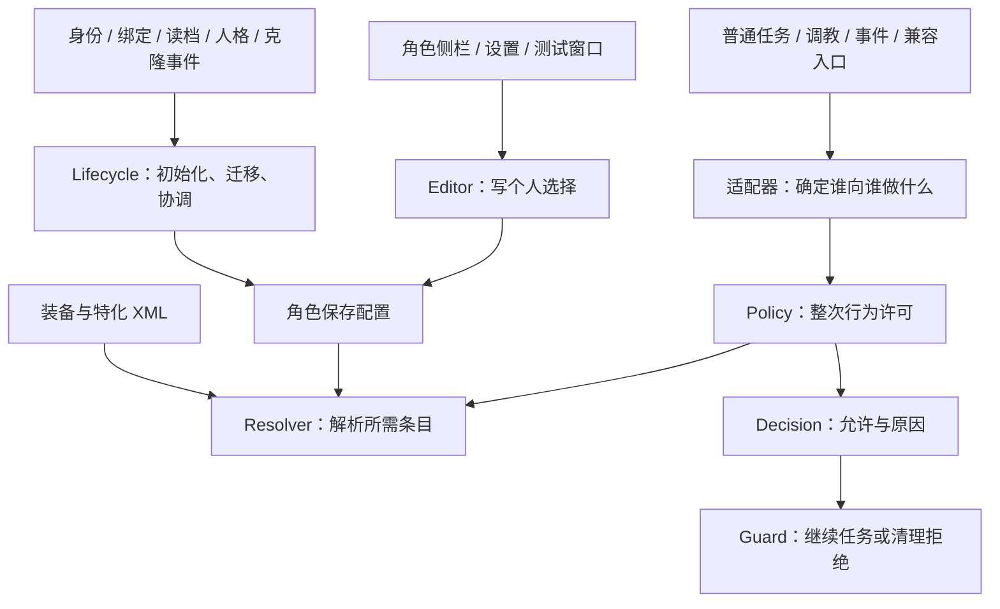

# 新限制系统功能代码导读与复盘

检查日期：2026-09-21（本地时间）。代码基线：`f5369b8`，即阶段 4 界面与按钮位置调整完成后的版本。

后续状态：本复盘的修复及局部整理已经实施；维护者进一步修订为“仅已绑定主人时启用限制”，并选择指定非主人调教员时同步授权调教。最新调用职责、范围及验证见[绑定门槛与职责整理](新限制系统绑定门槛与职责整理.md)。界面后续又按反馈加入强制条目锁定与默认子页，见[界面可用状态与默认子页](新限制系统界面可用状态与默认子页.md)。下文保留检查基线与发现过程，不应把其中的身份即生效、强制期间可编辑、旧方法名或待修复结论当作最新实现。

本文解释**目前实际代码**，并区分确定问题、维护风险和后续建议。早期阶段文档保留历史记录，不应把其中的“尚未接管”当作当前状态。本轮只新增导读与文档索引，没有修改运行代码、存档格式或已安装模组。

先说判断：**目前没有到需要推倒重写的程度；核心规则的划分基本合理，值得做定点修复和少量职责整理。** 复杂度主要集中在任务的准备、开始、保存恢复与取消，而不是六项许可本身。当前 `common/Restrictions` 目录有 19 个 C# 文件、2622 行（包含注释和空行，不含外围接入）；文件数量本身不能作为“屎山”的证据。

本轮重新运行 16 个测试套件，615/615 项通过；另外用生产生命周期代码的边界模型探针复现了一个死亡主人指派清理问题。测试通过与存在未覆盖边界并不矛盾，详细证据见后文。

## 1. 先分清系统回答的三个问题

| 问题 | 负责代码 | 举例 |
| --- | --- | --- |
| 这个角色保存了什么选择？ | `Data`、组件存档、`Editor`、`Lifecycle` | 玩家把接受非主人调教设为禁止 |
| 这次有方向的行为是否得到限制系统许可？ | `Policy` + `Resolver` | A 向 B 发起，是否命中主人放行；否则看哪些条目 |
| 游戏任务能否执行、何时检查、失败如何收尾？ | 调教适配、任务守卫、Harmony 接口 | 角色倒地、目标不可达、走近时设置改变、取消后撤销等待 |

这三件事必须分开。比如“主人获得许可”并不意味着游戏可以让倒地角色执行工作；“保存值是允许”也不意味着装备强制后仍然允许；“任务已经分配”更不等于行为已经开始。

几个阅读代码时经常出现的词：`Pawn` 是角色；`Comp` 是挂在角色上的组件；`Job` 是任务数据；`JobDriver` 是执行任务的对象；`Toil` 是任务中的一个步骤；`Scribe` 是游戏读写存档的接口；Harmony 的 `Prefix/Postfix` 分别是在原方法前后插入调用。



图中“统一入口”指整次行为许可都由 `Policy.Evaluate` 决定。界面调用 `Resolver` 显示某个条目的有效值，不是另设一套行为许可。

## 2. 数据：角色究竟保存了什么

从 [SSCRestrictionData.cs](../../Sexslavecraft/common/Restrictions/SSCRestrictionData.cs) 开始读最合适。

`SSCRestrictionRules` 保存六项规则；`Get/Set` 把布尔字段转换成统一枚举，供上层按条目访问。

| 枚举条目 | 意义 | 新规则对象的出厂值 |
| --- | --- | --- |
| `Masturbation` | 主动单人行为 | 禁止 |
| `ConsensualInitiation` | 主动发起普通双人行为 | 允许，仅限自己的实际主人 |
| `ForcedInitiation` | 主动发起强制行为 | 禁止 |
| `ReceiveConsensual` | 接受非主人普通双人行为 | 禁止 |
| `ReceiveForced` | 接受非主人强制行为 | 禁止 |
| `ReceiveTraining` | 接受非主人调教 | 禁止 |

只有 `ConsensualInitiation` 接受 `OwnerOnly`；其他五项只能允许或禁止。`Unspecified` 仅供 XML 表示“这项不覆盖”，不能出现在个人保存规则中。旧设置迁移、玩家编辑默认模板、当前特化默认都可能使实际初始配置不同于此表。

`SSCRestrictionConfig` 在六项之外再保存：

- `version`：配置格式版本，目前为 1；未知版本保留原数据并拒绝当成正常配置使用。
- `rules`：该角色独立拥有的规则对象。
- `busDefaultsApplied`：是否处理过公交车的一次性默认，防止反复切换特化或读档时覆盖玩家选择。

阶段 4 新增的 `preferredConsensualTarget` 只是开关记忆。例如玩家先选“不限对象”，再关掉主动发起，实际许可仍是 `Deny`，但再次开启会恢复“不限对象”。它不是第七项许可，判断行为时也不会拿它代替当前规则。旧档缺字段时根据原有值推导；坏偏好回退到仅限主人，不扩张实际许可。

这里使用 `Copy()` 是为了避免多个角色和全局模板共用同一对象。模板修改只影响之后初始化的角色；已经初始化的角色不会实时跟随模板变化。

角色组件上的保存入口在 [Comp_Train.Restrictions.cs](../../Sexslavecraft/Comps/Comp_Train.Restrictions.cs)。`partial` 表示它和 `Comp_Train.cs` 是同一个类拆成多个文件，不是额外挂了一份组件。

## 3. 许可：一次行为如何得到结果

### 3.1 Request、Decision 与 Resolution

[SSCRestrictionPolicy.cs](../../Sexslavecraft/common/Restrictions/SSCRestrictionPolicy.cs) 定义了查询请求和结果：

| 对象 | 回答的问题 | 主要字段 |
| --- | --- | --- |
| `SSCRestrictionRequest` | 谁向谁发起哪类行为？ | `Initiator`、`Receiver`、`Kind`、`DirectionKnown` |
| `SSCRestrictionDecision` | 这次行为被允许了吗？ | `Allowed`、`Reason`、`Subject`、`Entry` |
| `SSCRestrictionResolution` | 某个条目现在是什么值、为什么？ | `SavedValue`、`Value`、`Source`、`SourceDef`、`Valid` |

`Decision` 是一次行为结果，`Resolution` 是一个条目结果。主人直接通过时，不需要解析条目，因此 `Entry` 可以为空。普通双人成功时，`Entry` 也不是双方所有检查的完整历史，通常只保留最终相关条目；失败时则返回首先失败的位置。

### 3.2 Evaluate 的真实顺序

核心方法只有约 40 行分支逻辑；按下面的顺序读即可：

1. 请求本身为空：上下文不完整。
2. **方向已确认，发起者确实是接收者的绑定主人：立即允许整次行为。** 不继续检查类别、配置、装备或特化。
3. 总限制关闭：允许，原因是系统停用。
4. 确定双方是否属于管理对象：SSC 性奴身份或具有实际绑定关系。双方都不适用时不介入；首次绑定准备另有组件与资格处理。
5. 对需要管理的请求检查方向、参与者是否完整。
6. 根据用途读取所需规则；需要读取的配置不存在或损坏时拒绝，不临时自动初始化。

这说明主人许可不是“装备 > 主人”之类的覆盖排序。主人在进入条目解析前就结束了整个许可检查。反向行为、第三人、单纯具有主人身份的人不会得到这项待遇。

| 用途 `Kind` | 未命中主人直接放行时检查什么 |
| --- | --- |
| `Masturbation` | 发起者的单人规则 |
| `Consensual` | 适用发起者的主动普通规则，再查适用接收者的被动普通规则 |
| `Forced` | 主动强制规则，再查被动强制规则 |
| `PersonalityExcretion` | 按普通双人规则处理，不算调教 |
| `DailyTraining` / `RitualTraining` | 只查询目标的 `ReceiveTraining`，不叠加普通双人条目 |
| `BindingPreparation` | 未绑定、目标非主人身份、发起者为指定候选且有主人身份；后续还需正常工作资格 |
| 未知或缺少方向 | 若请求涉及管理对象且没有先行放行，则拒绝不完整上下文 |

`CheckPair` 的“仅限主人”检查的是**发起者自己的主人是不是当前目标**。它和前面的“实际主人向自己的对象发起”是相反方向。

### 3.3 有效值如何合成

[SSCRestrictionResolver.cs](../../Sexslavecraft/common/Restrictions/SSCRestrictionResolver.cs) 的 `Resolve` 每次读取当前状态，不跨查询缓存结果。

对于正常有效数据，代码先取个人保存值，再叠加特化强制，最后叠加装备强制。因此最终优先级为：

```text
装备声明的强制条目 > 已启用的特化强制条目 > 个人保存值
```

同一层有多个来源时取较严格值：禁止 > 仅限主人 > 允许；同值按 `defName` 稳定选择来源，避免日志随装备枚举顺序变化。没有声明的条目不参与覆盖。

这里有一个容易忽略的条件：**损坏数据诊断不按正常覆盖顺序消失。** 保存配置必须整体有效；某个特化覆盖在当前所需条目上非法时立即报告该错误，不因为后面有一件合法装备就把异常掩盖。主人直接允许与总开关停用仍在这些检查之前。

[SSCRestrictionDefinitions.cs](../../Sexslavecraft/common/Restrictions/SSCRestrictionDefinitions.cs) 负责 XML 数据结构和定义错误检查；它不执行任务。[公交车规则](../../Defs/SSCRestrictionProfiles.xml) 同时声明两项被动许可的默认值和强制值。两者都是允许，但用途不同：默认只在规定事件写一次，强制每次查询实时参与。[现有防护服](../../Defs/ThingsDefs/SexSlave_EvilFallOutfit.xml) 则仅声明 `receiveForced = Deny`。

例如个人禁止接受非主人强制行为，公交车强制为允许，穿着防护服又强制为禁止：最终禁止。脱衣后变为公交车允许，但保存值从未改过；再关闭特化强制，就回到个人禁止。实际主人向该角色发起时，以上三层都不再读取。

## 4. 配置什么时候写入：不是每次查询都“修复一下”

[SSCRestrictionLifecycle.cs](../../Sexslavecraft/common/Restrictions/SSCRestrictionLifecycle.cs) 负责写入事件；[SSCRestrictionGameComponent.cs](../../Sexslavecraft/common/Restrictions/SSCRestrictionGameComponent.cs) 负责当前存档的加载时机和全体角色协调。

| 事件 | 代码处理 | 保留什么 |
| --- | --- | --- |
| 新角色首次适用 | `Refresh` 复制当前模板，再合入当前特化默认 | 其他角色不受影响 |
| 旧档升级 | 用该存档固定的旧全局快照及旧个体输入迁移 | 旧选择，不套用后来改变的模板 |
| 首次取得公交车 | `TryApplyBusDefaults` 处理声明的默认并记一次性标记 | 后续反复切换不覆盖选择 |
| 装备穿脱 | 下一次解析读取当前装备 | 保存值不变，不需要缓存失效处理 |
| 人格恢复 | `BeginRestore` 暂缓中间事件，最外层完成后刷新 | 接收身体已有的配置 |
| 新克隆 | `ResetNewClone` 清除复制来的配置、迁移输入及处理标记 | 新身体独立初始化；旧克隆仍按自身旧档迁移 |
| 编辑某项 | `Editor.TrySet` 写入并协调指定者 | 装备与特化覆盖不写回 |
| 批量应用默认 | 固定模板和目标快照，逐个生成完整配置后替换 | 不改全局开关、身份、绑定、进度 |

批量操作是**逐个角色原子替换**，不是全存档要么全部成功要么全部回滚。一个角色生成新配置失败时保留其原配置，其他角色可以成功；界面分别报告成功、跳过、失败数量。

`Notify` 只在加载结束、当前游戏已准备好、角色不在人格恢复中时工作。`FinalizeInit` 先处理既有调教员身份迁移，再遍历地图、世界、临时容器、商队与运输对象。枚举先复制，是因为原版集合可能复用临时列表，关系修复也可能改变集合。

几个容易混淆的字段分别是：

| 字段 | 用途 |
| --- | --- |
| `restrictionLifecycleSeen` | 区分是否已经经过新系统的旧档识别，避免重复捕获迁移输入 |
| `legacyRestrictionInput` | 尚待迁移的旧个体开放值、公交车状态 |
| `restrictionRestoreDepth` | 人格恢复嵌套计数，最外层结束后才处理初始化和默认 |
| `busDefaultsApplied` | 公交车初始默认是否已处理，跟当前是否仍是公交车不是一回事 |
| `restrictionLastError` | 同一初始化错误不反复刷日志，不是许可缓存 |

### 4.1 为什么清理阶段仍留下旧字段

[SSCRestrictionMigration.cs](../../Sexslavecraft/common/Restrictions/SSCRestrictionMigration.cs) 只有迁移职责。旧字段不再参与运行许可。

旧的个体字段只在 `LoadingVars` 读入，然后形成待迁移快照；新存档不再写旧个体键。四个旧全局布尔值仍由 [SSCSettings.Restrictions.cs](../../Sexslavecraft/common/Restrictions/SSCSettings.Restrictions.cs) 保留，因为 Mod 设置跨存档共享：升级完存档 A 后，玩家仍可能再打开旧存档 B。

每个存档固定自己的旧全局快照，避免延迟恢复的角色被后来更改的设置影响。总限制关闭不会被迁移成“六项永久全允许”。旧公交车迁移还会保留旧逻辑映射出的调教开放值，而当前公交车 XML 本身只覆盖两项普通被动规则；**旧档迁移结果与新建角色默认不必相同**。

当前代码专门为公交车保留 `busDefaultsApplied`，对现有唯一需求是合理的。如果以后增加第二种“取得时写一次默认”的特化，不能仅加 XML 就认为取得事件已支持：通用 XML 默认能参与首次初始化，但后续取得默认的生命周期分支目前专门处理公交车。到那时再考虑带版本迁移的“已处理特化集合”，不必现在先做大型通用系统。

### 4.2 指定调教员为什么会随着设置改变

`CoordinateTrainer` 处理“禁止非主人调教则指定者固定为实际主人”。开放后保留当前指定者，等待玩家选择，不偷偷恢复更早的人选；关闭总限制时解除限制带来的锁定。

指定者和实际主人是两份不同信息。指派其他调教员不会换主，同床也继续使用既有关系接口，而不是直接由普通行为许可控制。当前死亡主人引用回写的边界问题见第 9 节，不能为修复指派而擅自删除所有权或允许第三方接替。

## 5. 任务为什么比规则复杂

普通任务主线可以按下面顺序阅读：

```text
玩家命令 / AI 候选
  → 提前预检（尽量不打断原工作）
  → 预约前检查
  → 走近、准备、切换 Toil 前复查
  → 原生 Start 前最后检查
  → 原生 Start 确实运行后记录 Started
  → 当前场景正常执行、收尾
```

这不是多套规则在重复判定。它们都调用同一许可入口，解决的是“候选产生后、实际开始前，规则或角色关系可能变化”的时间差；外部模组也可能跳过某个较早入口直接启动任务。

### 5.1 Context 只负责辨认行为

[SSCRestrictionJobContext.cs](../../Sexslavecraft/common/Restrictions/SSCRestrictionJobContext.cs) 的 `TryCreate` 将 RJW 驱动转换成请求：

- 发起任务读取自己的真实目标；接收任务沿 `Partner` 找到仍指向自己的发起任务。
- 先识别日常、仪式、单人、人格排泄，再识别普通/强制。
- 姿势反转不改变发起方向；已有 `SexProps` 必须和当前参与者一致，不能拿旧数据猜。
- 无真实互动发起者的 `BeOnahole` 常驻任务只是家具占用，不构造行为请求；一旦有真实发起者仍完整检查。

接收端调用 `TryCreate` 不是把接收者当成另一个主动发起者重新检查，避免方向颠倒。

### 5.2 Guard 管的是任务状态

[SSCRestrictionJobGuard.cs](../../Sexslavecraft/common/Restrictions/SSCRestrictionJobGuard.cs) 的几个主入口：

| 方法 | 意义 |
| --- | --- |
| `TryReserve` | 预约时只返回结果，不在安装驱动过程中递归结束任务 |
| `TryCheck` | 步骤/开始前复查，失败则执行清理 |
| `TryMarkStarted` | 只有原生 Start 真执行且仍是当前驱动才记录开始 |
| `TryEnd` | 阻止未开始的被拒绝任务执行成功式收尾 |
| `ExposeData` | 保存方向、开始状态、准备任务归属、通知状态；恢复旧档进度 |
| `TrackPreparation` / `CleanupPreparation` | 记录并撤销本次请求创建的移动/等待 |
| `PrepareEvent` / `RegisterEventWait` | 事件预检及等待任务登记 |

`TryReserve` 等方法的返回值表示“是否属于处理范围”，`out allowed` 才是是否允许。返回 `false` 不是许可拒绝。这种双布尔约定需要在阅读调用点时留意。

`SceneState` 绑定驱动、Job 对象和 `loadID`。同时比较引用和编号，是因为任务对象可能被池化复用。`ConditionalWeakTable` 将额外状态附着于这些游戏对象，避免用永久字典持有已不用的任务；序列化仍需显式通过 `ExposeData` 写入，弱表本身不会自动存档。

**预检驱动和真正运行的驱动不是同一个实例。** `GetCachedDriver` 用于检查，`StartJob` 会另建运行驱动。因此交易/宠物事件先把来源与等待任务寄存在 Job 上，运行驱动第一次查询时领取，不能只把信息放在预检驱动里。

开始凭据只有在同一有向场景中有效。配置变化不打断已经开始的当前场景，但新任务、新加入者或仪式下一阶段仍要重新查询。旧存档没有新凭据时，代码按已有实际进度恢复；只有 `SexProps` 或接收准备数据不能证明开始。

拒绝时不能清空目标所有工作。代码只撤销本次请求创建的准备 Job 编号、对应接收关联，并保留后来替换的新任务、其他参与者以及家具常驻任务。`Incompletable` 表示任务未完成，避免被误算成一次成功行为。

[SSCRestrictionJobHooks.cs](../../Sexslavecraft/common/Restrictions/SSCRestrictionJobHooks.cs) 与 [Harmony_ProtectSexSlave.cs](../../Sexslavecraft/ThePatches/Harmony_ProtectSexSlave.cs) 负责把这些方法挂到游戏时机。后者保留旧名字，但里面已经是新守卫转接，不是残留的第二套锁链保护算法。

## 6. 日常调教、仪式与事件分别怎么接入

### 6.1 日常与仪式

[SSCRestrictionTrainingUtility.cs](../../Sexslavecraft/common/Restrictions/SSCRestrictionTrainingUtility.cs) 的 `CreateRequest` 区分首次绑定准备和已绑定调教；`TryEvaluate` 先调用 Policy，再检查正常调教资格与工作关系。

自动日常由 `WorkGiver_Training → TrainerAssignmentUtility → TrainingUtility` 查找和验证目标；实际驱动继续经过统一任务守卫。自动工作只给唯一有效指定者，没有人或指定者不可用时不临时让其他人接替。实际主人手动发起或主持时，不会因为另有指定者而被限制系统排除。

仪式的两端选角、每阶段 `JobGiver_RitualMaster` 发工作以及实际 `JobDriver_RitualTraining` 都接入了相应检查。整场状态由 `BindingRitualStateUtility` 管理，驱动只执行当前阶段。当前阶段已开始就正常收尾；下一阶段拒绝时取消对应仪式，不能继续空转或发成功 memo。阶段结算的防重入与一次性领取不能简单删去，因为末阶段通知可能同步触发清理回调。

`LegacyTrainingUtility` 的 Legacy 指旧训练计分实现，不是旧限制许可；`FineTrainingUtility` 是另一计分实现的占位。它们不应因名称带 Legacy 就被当作本次限制清理对象。

### 6.2 交易与宠物事件

[Harmony_BusTrade.cs](../../Sexslavecraft/ThePatches/Harmony_BusTrade.cs) 和 [DogSpecializationUtility.cs](../../Sexslavecraft/common/DogSpecializationUtility.cs) 保留各自概率、成长、身体条件与冷却，只有行为许可进入统一系统。

交易先创建最终互动 Job，再 `PrepareEvent` 预检；通过后才安排对方 600 ticks 等待、登记等待编号并启动。宠物事件先确定床上/地面真实驱动，再交由 Context 分类，不能仅凭“宠物事件”四个字认定为某种许可。

调度成功不代表行为发生。“行为已发生”的提示由守卫在实际 Start 后发一次，并保存去重状态；贸易好感、拒绝谅解等消息仍由交易入口按各自条件发送。成交/工作本身的成长与行为成长分开；许可拒绝也不会把原本已经消费的宠物事件抽签冷却返还。

### 6.3 原版 Lovin、LifeForce 与家具边界

[SSCRestrictionLovinGuard.cs](../../Sexslavecraft/common/Restrictions/SSCRestrictionLovinGuard.cs) 单独处理原版双方都是 `JobDriver_Lovin` 的情况。它在原版同步创建接收端时传递真实方向，记录双端 Job 编号，并在配对初始化成功后标记开始。包装现有回调而不增删 Toil，是为了保持旧存档的步骤索引。

[SSCRestrictionExternalJobs.cs](../../Sexslavecraft/common/Restrictions/SSCRestrictionExternalJobs.cs) 处理已知非 RJW 基类入口。LifeForce 的 `Seduced` 驱动执行者是被吸引后走过去的人，`targetA` 才是最终场景发起者，不能按驱动所属角色误判方向。能力 `Valid` 保留原有拒绝；`Apply` 在打断工作前复查；走近任务换步骤时再查。分类依据最终 SexOnSpot 驱动，不依据能力界面开关的名称。

兼容使用完整类型名和反射，未安装模组时不引入硬依赖。覆盖范围是已接入的 LifeForce、原版 Lovin 和现有 Onahole 互动桥接，不是对任意第三方独立任务都自动生效。家具自身占用/睡眠与角色间真实互动分开处理，是任务范围区分，不是许可白名单。

## 7. 界面点击后发生了什么

[SSCRestrictionUI.cs](../../Sexslavecraft/common/Restrictions/SSCRestrictionUI.cs) 是侧栏、独立编辑页、全局默认模板共用的控件。显示左文右勾叉；主动普通行为下的两个单选项映射到原来的 `OwnerOnly/Allow`，不是另外增加两套规则。

典型修改流程为：

```text
点勾叉 → Editor.TrySet → 校验适用性、配置、输入
       → 修改个人保存值 → CoordinateTrainer → 下次查询看到新结果
```

绘制本身只读。装备/特化存在时仍然可以编辑个人选择；强制来源和实际有效值通过短标记、悬停说明展示。覆盖消失后重新使用个人保存值。

左栏“是调教员”管这个角色是否能担任调教者；原有“允许调教”、排班等管正常工作条件；右栏“接受非主人调教”管具体来源的许可。这些开关处理的不是同一件事，因此没有全部合并成一个布尔值。

[ITab_SexSlaveTraining.cs](../../Sexslavecraft/ITab/ITab_SexSlaveTraining.cs) 负责宿主布局：展开按钮紧邻调教设置上方，右侧独立滚动，主栏宽度保持；顶部为原生关闭按钮留空。切换角色只重置对应滚动状态，不初始化或修改配置。

[Dialog_SSCRestrictions.cs](../../Sexslavecraft/common/Restrictions/Dialog_SSCRestrictions.cs) 的编辑页复用上述控件；测试页直接调用 Policy，显示许可结果，但**不执行真实任务，也不代表身体、预约、工作资格已经通过**。它和 [DebugActions_SSCRestrictions.cs](../../Sexslavecraft/common/Restrictions/DebugActions_SSCRestrictions.cs) 中的开发预览还不同：后者可以临时用默认值推演缺配置角色，正式任务不允许这样回退。

## 8. 文件导航：后续改功能先找哪里

所有名称以下均指 `Sexslavecraft/common/Restrictions/`，除非另有说明。按职责读，比按开发阶段或文件名顺序读更容易理解。

| 文件 | 主要职责 | 推荐阅读位置 |
| --- | --- | --- |
| `SSCRestrictionData.cs` | 六规则、配置版本、对象范围偏好、复制及存档 | `Get/Set`、`IsValid`、`ExposeData` |
| `SSCRestrictionDefinitions.cs` | 特化/装备 XML 与稀疏覆盖 | `Overrides`、`ConfigErrors` |
| `SSCRestrictionPolicy.cs` | 唯一整次行为许可 | `Evaluate → CheckPair → Check` |
| `SSCRestrictionResolver.cs` | 有效值合成，以及当前放在这里的配置构建 | `Resolve`、`Layer`、两个默认构建方法 |
| `SSCRestrictionMigration.cs` | 旧全局/个体输入映射 | `Capture`、`Convert` |
| `SSCSettings.Restrictions.cs` | 默认模板、特化开关及旧设置键读写 | `ExposeRestrictionSettings` |
| `SSCRestrictionLifecycle.cs` | 初始化、一次性默认、恢复隔离、批量重置、指派协调 | `Refresh`、`RestoreScope`、`CoordinateTrainer` |
| `SSCRestrictionGameComponent.cs` | 存档快照、就绪时机、跨地图角色遍历 | `FinalizeInit`、`Notify` |
| `SSCRestrictionLifecycleHooks.cs` | 将身份、绑定、特化、人格、克隆等事件接上生命周期 | 各 `Postfix`、人格 `Prefix/Finalizer` |
| `SSCRestrictionEditor.cs` | 界面写入的校验入口 | `TrySet`、`TryInitialize` |
| `SSCRestrictionJobContext.cs` | 从真实驱动提取有向请求 | `TryCreate` |
| `SSCRestrictionTrainingUtility.cs` | 调教用途、工作资格与指派适配 | `CreateRequest`、`TryEvaluate` |
| `SSCRestrictionJobGuard.cs` | RJW 场景开始凭据、拒绝、恢复与事件交接 | `TryReserve/Check/MarkStarted` |
| `SSCRestrictionJobHooks.cs` | 玩家命令、AI、派生预约及保存补丁 | 各 Hook |
| `SSCRestrictionExternalJobs.cs` | 已知独立驱动与可选能力接入 | `TryReserve`、`CheckBeforeToil` |
| `SSCRestrictionLovinGuard.cs` | 原版双端配对、方向、开始与恢复 | `Request`、`InitializePair`、`ExposeData` |
| `SSCRestrictionUI.cs` | 共用紧凑控件、模板与个人规则显示 | `DrawPawn`、`DrawChoice` |
| `Dialog_SSCRestrictions.cs` | 编辑和许可测试窗口 | `DrawEditor`、`DrawTest` |
| `DebugActions_SSCRestrictions.cs` | 开发模式只读推演 | `ShowReport`，注意下述过时提示 |

目录外还需连着看：组件保存入口、`Settings.cs`、ITab、`Harmony_ProtectSexSlave`、`TrainerAssignmentUtility`、训练/仪式 JobGiver 和 JobDriver、交易与宠物事件。绑定和同床代码是其依赖关系，不是新限制系统的所有代码都应搬进本目录。

排查时可以按症状找入口：

| 现象 | 首先查看 |
| --- | --- |
| 测试页的许可本身不对 | Request 的方向/用途，再看 Policy 与 Resolver 来源 |
| 测试页允许但任务不执行 | 工作资格、指派、研究、身体、预约；再看实际驱动提供的上下文 |
| 读档后个人选择变化 | 组件迁移输入、GameComponent 快照、Lifecycle 默认写入 |
| 装备脱下后仍显示错误 | 区分保存值和强制值，核对当前特化及 XML 声明 |
| 被拒绝后角色一直等待 | Guard 记录的 PreparedJobs 与实际 Job 编号 |
| 原版或第三方入口失效 | 补丁目标是否匹配、任务类型/Toil 时序是否变更 |

## 9. 本轮复盘发现：按确定性与优先级分开

### 9.1 确定的功能边界问题：死亡主人指派被清除后又写回

严重度：低，建议先于结构重构修复。

证据在 `SSCRestrictionLifecycle.cs` 的 `CoordinateTrainer`（基线第 98 行开始）：先在第 102—103 行清除死亡/销毁的指定者，随后第 104—105 行用 `GetForcedTrainer` 返回值重新赋值。`SSCRestrictionTrainingUtility.GetForcedTrainer` 第 15 行直接返回绑定主人，没有排除死亡。

当主人已死亡、绑定仍在、`ReceiveTraining = Deny` 时，最终 `selectedTrainer` 又是该死亡主人。实际 `SSCBondUtility.GetBoundMaster` 只读锁链引用；`Hediff_ChainOfSexSlave.ShouldRemove` 不以 `Dead` 为移除条件，因此这不是只能人工构造的关系。销毁引用会在健康状态清理后移除，死亡引用是更稳定的复现条件。

本轮使用 `Tests/RestrictionCore` 编译的生产 Lifecycle/TrainingUtility 执行独立探针，结果为：

```text
ReceiveTraining = false
OwnerDead = true
SelectedTrainerCleared = false
SelectedTrainerIsDeadOwner = true
```

探针中的 Pawn、绑定读取是测试替身，实际锁链保留死亡主人的条件另由生产源码核对；这不等于完成了一次完整实机死亡流程。现有测试覆盖的是“已开放非主人调教时清理死亡的第三方指定者”，遗漏了“被强制指派的主人死亡”组合。

影响是失效指派清理不完整，不是第三方获得许可；工作资格仍拒绝死亡角色。最小修复应限制 `CoordinateTrainer` 的回写，保留原有所有权和非主人调教禁令。不要简单让 `GetForcedTrainer` 遇死亡返回空并顺带改变界面锁定语义。补测试覆盖死亡主人、销毁主人、正常主人以及开放/关闭限制状态。

### 9.2 确定的诊断错误：阶段 1 预览仍声称实际任务使用旧规则

`DebugActions_SSCRestrictions.cs` 第 39—40 行仍输出阶段 1 标题及“Actual jobs still use legacy rules / 实际任务仍使用旧规则”。当前 3A—3C 已接管，文字已过时。`Policy` 的类注释也还提及后续批次旧任务。

这不改变许可，但会直接误导读代码和调试。应更新开发入口名称、报告文案和阶段性注释，或将有用的只读推演整合进现有诊断入口。保留“只测许可，不执行任务”的准确边界。

### 9.3 确定存在、低风险可优化：关闭日志仍先构造详细字符串

`SSCRestrictionJobGuard.LogDecision`（第 385 行）在调用 `SSCLog.Verbose` 前就拼接双方名字、用途、来源等；`SSCLog.Verbose` 进入方法后才检查开关。高频预约/步骤检查在详细日志关闭时仍有不必要的字符串分配。

建议在共享日志类提供一致的 `VerboseEnabled` 判断，调用点在格式化前返回。应优先采用无闭包的开关判断，避免换成捕获 Lambda 后又引入新分配。**没有 profiler 数据，不能把它描述为已证实的卡顿原因。**

### 9.4 值得整理：守卫逐渐承担了过多外围职责

`JobGuard` 目前 394 行，长度本身不异常，但同时管理场景凭据、旧档恢复、准备任务归属、事件交接和交易/宠物通知文案。未来每加一种事件都往这里加分支，会使任务生命周期越来越难单独阅读。

建议先抽出一个小的“事件交接与通知”模块，再视需要把准备任务登记/清理收拢成小对象。守卫保留检查时机、开始/拒绝状态转换和调用顺序。旧档恢复也可独立组织，但必须保留原保存键及语义。

不要只拆成多个 `partial` 文件就宣称职责解耦；如果字段仍被任意跨文件读写，维护风险没有减少。也不要将 RJW 与 Lovin 强行继承同一基类，两者开始证据不同。

### 9.5 值得整理：Resolver 混入配置构建与写入

`Resolve` 是只读解析，但同一个类里的 `TryCreateInitialConfiguration` 构建新对象，`TryApplyBusDefaults` 还直接改传入的 `config.rules` 和 `busDefaultsApplied`。目前调用者明确，所以不是已确认副作用 bug；类注释“只读解析”却无法准确概括全部方法。

适合将初始配置/默认合成放到具体的配置构建助手，返回完整候选结果，再由 Lifecycle 决定提交。这样“读取有效值”和“写入保存值”在文件层面也清楚。无需同时引入依赖注入框架、泛型规则引擎或修改存档格式。

### 9.6 值得整理：许可结果与工作准入结果的接口容易误用

`SSCRestrictionTrainingUtility.TryEvaluate` 返回 bool，同时输出一个 Policy Decision 和文字原因。主人已获许可但身体/身份不符合时，会出现 `return false`、`decision.Allowed == true`。当前调用者正确使用返回 bool，这不是现有越权问题。

建议将其表达为明确的工作准入结果：整体是否可执行、许可判定、工作拒绝原因。拒绝原因可用小枚举，界面/日志再本地化。不要因此把身体、工作指派塞回 Policy；否则统一许可核心会膨胀成整个调教业务控制器。

### 9.7 兼容维护风险：缺席与签名变更目前都静默跳过

`ExternalJobs` 的可选补丁在目标类型或方法不存在时用 `Prepare` 跳过。未安装模组时这是正确行为；已安装但新版本改变签名时，准备入口也可能静默失去适配。

Lovin 还依赖已核对的原版细节：配对回调的声明类型、旧档步骤索引 3、接收端倒计时量级。当前本机版本有核验依据，不是本轮确认的失效；更新游戏或其他模组包装回调时需要重新确认。

建议建立一次性的兼容能力报告，区分未安装、已适配、已识别但目标不匹配；并把已有本机元数据检查纳入可重复的维护脚本。缺可选模组保持安静，不在高频查询反复报警，也不建立庞大的插件框架。

### 9.8 可以逐步改善，但不宜混进首次重构

| 位置 | 当前问题/风险 | 合适处理 |
| --- | --- | --- |
| `LifecycleHooks` | 本 Mod 自己的身份/绑定方法也靠 Harmony 后缀接线，单看原方法看不到通知 | 选取少数完整事务边界改为显式通知；保留游戏/第三方的 Harmony。必须一起移除对应旧 Hook，避免重复通知 |
| `Policy.Check` + `Resolver.Resolve` | 重复检查六项有效性；UI 每轮还按六项重新扫描来源 | 先测量；必要时只复用单次查询/绘制内的快照，保留公开入口校验。不要先上跨 tick 缓存 |
| 交易与宠物入口 | 预检、启动、确认接收、失败撤销有相似流程 | 可提取有限的调度助手；保留各自概率、冷却、成长及交易等待差异 |
| `WorkGiver_Training.HasJobOnThing` 第 57 行 | 旧实现通过 `JobOnThing != null` 判断，查询时构造随后丢弃的 Job；候选层也重复完整检查 | 单独整理共享验证与最终 Job 创建，属于早于本次系统的外围问题 |
| `TrainerAssignmentUtility.TryGetTrainingTargetFailureReason` | 查询内还恢复仪式状态、修正训练标记，并可进入旧 LifeForce 冲突清理 | 后续分离纯查询与准备/修复副作用，不可直接删掉修复 |

本轮还专门复核了“为什么 Context 参考目标正在执行的强制接收驱动”。本机 RJW 的 `JobDriver_SexBaseInitiator.Start` 第 15 行本身就用“当前发起驱动为强制，或目标当前接收驱动为强制”判断，随后把新参与者加入接收端。这一条件有实际依赖源码依据，不能凭“没有检查 Partner 相等”就判为误分类或加上限制。后续针对走近期间接收任务更换的测试，应关注时间差，不把这项现有分类直接列为缺陷。核对来源为本机 `D:/STEAM/steamapps/common/RimWorld/Mods/RJW_核心_本体/1.6/Source/JobDrivers/JobDriver_SexBaseInitiator.cs`，不外推为所有 RJW 版本的保证。

## 10. 哪些复杂度应该保留，怎样避免继续堆积

以下部分看着繁琐，但直接删除会损坏已经明确的行为约定：

- 主人优先判断必须在唯一许可入口内部，并先于用途与配置校验。
- 保存值与实时强制值分离；默认只在规定事件写入。
- 预约、准备、实际开始各自复查；同一已开始场景正常收尾。
- Job 实例/编号和方向验证；事件从预检 Job 交给真正运行驱动。
- 准备任务按归属精确清理；保留家具占用和其他参与者。
- 人格恢复作用域、旧档迁移快照、不同阶段加入的保存标志。
- 仪式整场与阶段的分离、一次性结算、防重入。

后续维护最有效的约束是：新增玩法只负责提供“谁向谁做什么”，不能在事件入口加新的主人/公交车/装备白名单；新增装备只声明条目；新增 UI 复用 Editor；新增兼容适配明确其方向、开始证据、清理归属和验证版本。

如果决定实施重构，建议拆成可单独回归、提交的三批：

| 顺序 | 范围 | 完成标准 |
| --- | --- | --- |
| 第一批：小修复 | 死亡指派、过时开发提示、日志开关前置 | 有针对回归，许可矩阵及存档键不变 |
| 第二批：职责整理 | 配置构建从 Resolver 分离；JobGuard 事件/准备职责整理；明确调教准入结果 | 每次只移动一个职责，旧场景保存恢复与拒绝清理仍通过 |
| 第三批：兼容与外围维护 | 可选入口能力诊断、元数据验证；按需要整理工作查询副作用和自有事件通知 | 验证缺模组、目标不匹配、读档和实机任务时序，避免静默退化 |

这三批是建议的维护顺序，不表示已经实施，也不替代规划中的阶段 5 实机回归。不建议为了“清爽”一次改完所有层，或把现在六项明确规则泛化为一个难以调试的万能策略框架。

## 11. 本轮验证与尚未证明的部分

本轮命令为 `Scripts/Test-All.ps1`，显式使用真实 Harmony 2.4.2 程序集。报告位于本地 `.builds/restriction-stage4-review/validation/summary.json`：16/16 套件，615/615 项通过。较直接相关的是 RestrictionCore 115、InteractionProtection 104、BusTrade 42、TrainerIdentity 41、RitualLifecycle 50、SharedBed 93。

这些项目直接编译生产核心及相应适配代码，不是另写一份规则自测；但 Pawn、游戏世界、Scribe 和第三方驱动边界仍使用替身。核心套件也没有编译 `LifecycleHooks`，不能将生命周期方法测试等同于全部事件接线验证。真实 Harmony 验证的是模型中的补丁安装和调用，不会自动证明下一版原生游戏的私有结构没有变。

死亡主人独立探针输出保存在 `.builds/restriction-stage4-review/dead-owner-probe.json`，未计入 615 项既有套件。本轮未新增正式回归、未启动游戏进行新场景测试，也未测量性能。

下一轮修复/重构最需要补强的验证，是死亡主人指派、走近期间改设置、实际开始前后存读档、旧场景恢复、准备被外部取消、目标已有其他场景、Lovin 替换开启/关闭及兼容模组缺席/签名不匹配。不要只继续增加六项规则的重复组合测试，而忽略任务真正接入游戏的边界。
